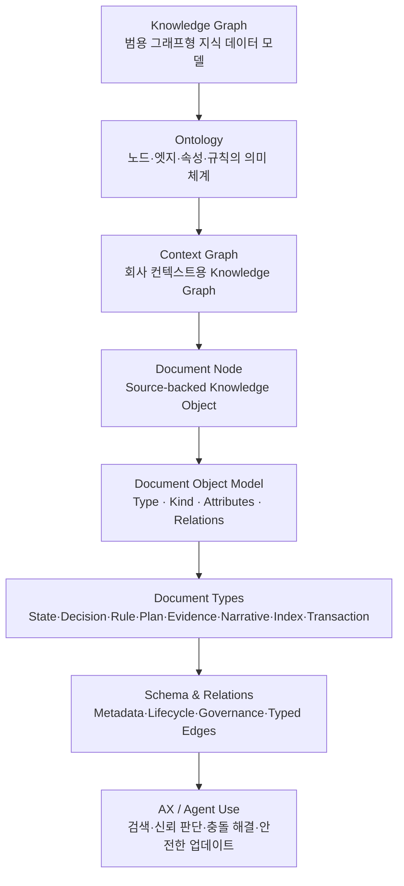

## Executive Summary
Knowledge Graph는 엔티티와 관계를 그래프 구조로 저장하고 탐색하는 **범용 데이터 모델 패턴**이다. Ontology는 이 그래프의 노드 타입, 엣지 타입, 속성, 제약, 추론 규칙을 정의하는 **의미 체계 / schema layer / semantic contract**다. Context Graph는 회사 컨텍스트 저장, 탐색, 추론, AI Agent 사용에 최적화된 **도메인 특화 Knowledge Graph**다.

이 문서는 Context Graph 안에서 문서를 어떻게 **Document Node**로 정의할지 정리한다. 여기서 문서는 단순한 파일, 페이지, 노트, 텍스트 chunk가 아니라, 출처·권위·시간·소유자·상태·관계를 가진 **source-backed knowledge object**다.

문서 시스템의 목적은 문서를 많이 저장하는 것이 아니다. 각 문서가 어떤 역할을 수행하는지 명확히 식별하고, 사람과 AI Agent가 해당 문서를 올바른 맥락에서 해석하도록 만드는 것이다.
> 🧭 이 문서의 중심 관점: **문서 분류표**를 만드는 것이 아니라, 회사 컨텍스트를 Knowledge Graph로 만들기 위한 **Document Ontology**를 정의한다.
---
## 1. 핵심 정의
### 1.1 Knowledge Graph
Knowledge Graph는 특정 도메인에 고정된 개념이 아니라, **엔티티와 관계를 그래프 구조로 저장하고 탐색하는 데이터베이스 형식 또는 데이터 모델 패턴**이다.

같은 Knowledge Graph 접근은 서로 다른 도메인에 적용될 수 있다.
- 교통 빅데이터: 도로, 차량, 정류장, 사고, 시간대, 이동 패턴을 노드와 엣지로 표현
- 바이오메디컬 데이터: 유전자, 질병, 약물, 논문, 임상시험 관계를 표현
- 기업 지식 데이터: 문서, 사람, 팀, 제품, 고객, 의사결정, 정책 관계를 표현
따라서 Knowledge Graph는 “회사 문서 시스템” 자체가 아니라, **관계 중심으로 지식을 저장하는 범용 그래프형 데이터 모델**이다.
### 1.2 Ontology
Ontology는 Knowledge Graph 또는 Context Graph의 **의미 체계**다. 어떤 것이 노드가 될 수 있는지, 어떤 관계가 엣지가 될 수 있는지, 각 노드와 엣지가 어떤 속성을 가져야 하는지, 어떤 제약과 추론 규칙을 따르는지를 정의한다.

즉 Ontology는 그래프 안의 노드 하나가 아니라, 그래프를 설계하고 해석하기 위한 **schema layer, semantic contract, type system**에 가깝다. 더 넓게 보면 Ontology는 “무엇이 무엇인가”를 정의하는 정적 의미 체계에 머물지 않는다. 그래프 위에서 어떤 행동을 실행할 수 있는지, 어떤 계산과 판단을 재사용할 수 있는지, 누가 어떤 객체와 행동에 접근할 수 있는지까지 함께 규정하는 **운영 계약(operational contract)** 이 될 수 있다.

따라서 Context Graph의 Ontology는 두 층으로 이해할 수 있다. 첫째, 노드·엣지·속성·규칙을 정의하는 **의미 레이어(semantic layer, 명사)** 다. 둘째, Action·Function·Security / Permission을 정의하는 **운동 레이어(kinetic layer, 동사)** 다. 의미 레이어가 그래프의 구조와 해석 기준을 만든다면, 운동 레이어는 그 그래프 위에서 사람과 AI Agent가 무엇을 할 수 있고, 어떤 조건에서 실행할 수 있으며, 어떤 결과를 만들어야 하는지를 정의한다.

예시:
- Node type: Document, Person, Team, Product, Customer, Decision, Claim, Evidence, Policy
- Edge type: owns, references, supersedes, supports, contradicts, applies_to, approved_by, derived_from
- Properties: authority_level, lifecycle_status, valid_from, valid_until, source_system, owner, access_level, confidence_score
- Rules: Deprecated 문서는 Active 문서보다 낮은 우선순위를 갖는다. supersedes 관계가 있으면 최신 문서를 우선한다.
- Actions: `promote`, `supersede`, `update_living_document`, `append_correction`, `request_review`
- Functions: `compute_confidence`, `resolve_authority`, `is_stale`, `detect_conflict`
- Security / Permissions: `sensitivity=Confidential` 문서는 특정 역할에만 노출된다. Authoritative Policy는 owner 팀만 갱신할 수 있다.
Ontology는 노드·엣지·속성·규칙 같은 **의미 레이어(semantic layer, 명사)** 에 더해, 그래프 위에서 무엇을 할 수 있는지를 정의하는 **운동 레이어(kinetic layer, 동사)** 까지 포함할 수 있다. 운동 레이어는 Action, Function, Security / Permission 세 요소로 구성된다. 이는 팔란티어(Palantir) 온톨로지가 명사(객체·속성·관계)와 동사(액션·함수·동적 보안)를 함께 정의해 "조직의 운영 계층(operational layer)"을 만드는 것과 같은 구조다. 즉 온톨로지는 "무엇이 무엇인지"뿐 아니라 "그 위에서 무엇을 할 수 있는지"까지 규정한다.
#### Action — 그래프 위의 동사
Action은 그래프의 노드·엣지·속성을 바꾸는 **정의된 변경 동작(typed transaction)** 이다. 단순한 데이터 수정이 아니라, 어떤 입력(파라미터)을 받고, 어떤 전제조건(submission criteria)을 통과해야 하며, 어떤 side effect와 보안 규칙을 따르는지가 함께 선언된다. 실행 주체는 사람일 수도, 결정론적 함수일 수도, AI Agent일 수도 있다. 핵심은 "프로그래밍이냐 에이전트냐"가 아니라 **행동 계약(action contract)이 정의되어 있는가**이다.
- 예: `promote`(문서를 Draft → Active로 승격), `supersede`(이전 문서를 대체), `propagate_update`(의존성 엣지를 탄 문서를 함께 갱신)
#### Function — 재사용 가능한 계산·로직
Function은 그래프 데이터를 입력받아 값을 계산하거나 파생 정보를 만들어내는 **재사용 가능한 로직**이다. 상태를 직접 바꾸기보다 판단·점수·요약을 제공하며, Action의 전제조건이나 우선순위 계산에 쓰인다.
- 예: `compute_confidence`(문서 신뢰도 계산), `resolve_authority`(가장 권위 있는 현재 문서 선택), `is_stale`(review_due_at 경과 여부 판정)
#### Security / Permission — 동적 접근·실행 권한
Security / Permission은 **누가(어떤 사람·팀·Agent가) 어떤 노드를 보고, 어떤 Action을 실행할 수 있는지** 를 규정한다. 정적인 문서 권한을 넘어, 문서의 `sensitivity`·`authority_level`·`lifecycle_status` 같은 속성에 따라 동적으로 결정된다(dynamic security).
- 예: Authoritative Policy는 owner 팀만 `update_living_document`를 실행할 수 있다. `sensitivity=Confidential` 문서는 특정 역할에만 노출된다.
### 1.3 Context Graph
Context Graph는 Knowledge Graph의 한 특수화된 형태다. 즉, **회사 컨텍스트 저장, 탐색, 추론, AI Agent 사용에 최적화된 노드 타입과 엣지 타입을 가진 Knowledge Graph**다.

Context Graph의 목적은 단순히 데이터를 연결하는 것이 아니라, 회사 안에서 다음 질문에 답할 수 있게 만드는 것이다.
- 무엇을 믿어야 하는가?
- 어떤 문서가 최신인가?
- 어떤 결정이 어떤 근거에서 나왔는가?
- 어떤 정보가 어떤 팀·제품·고객·업무에 적용되는가?
- Agent는 어떤 문서를 근거로 답변하거나 실행해야 하는가?
### 1.4 세 개념의 관계
정리하면 다음과 같다.
```text
Knowledge Graph
= 범용 그래프형 지식 데이터 모델

Ontology
= 그래프의 노드 타입, 엣지 타입, 속성, 규칙을 정의하는 의미 체계

Context Graph
= 회사 컨텍스트 저장과 Agent Experience에 최적화된 Knowledge Graph의 도메인 특화 구현
```

---
## 2. Context Graph에서 문서의 정의
### 2.1 Document = Source-backed Knowledge Object
Context Graph에서 문서는 조직 지식을 담고 있는 **식별 가능한 지식 객체**다. 문서는 원문 텍스트만으로 정의되지 않는다. 문서는 출처, 생성자, 소유자, 시간 범위, 권위 수준, 생명주기 상태, 변경 가능성, 기능 역할, 적용 대상, 버전, 파생 관계, 근거 관계를 함께 가진다.

표준 정의:
> Context Graph에서 문서는 조직 지식을 담고 있는 **source-backed knowledge object**다. 문서는 원문 텍스트뿐 아니라 출처, 생성자, 소유자, 시간 범위, 권위 수준, 생명주기 상태, 변경 가능성, 기능 역할, 적용 대상, 버전, 파생 관계, 근거 관계를 가진다. 문서는 사람과 AI Agent가 어떤 정보를 신뢰하고 어떤 맥락에서 사용해야 하는지 판단하게 하는 기본 단위다.
기술적으로 문서는 Context Graph 안의 하나의 graph node로 정의할 수 있다.
```text
Document = Source-backed Knowledge Object
```
A document is a graph node that:
1. contains or points to textual / structured content,
2. has provenance and lifecycle metadata,
3. has authority and temporal scope,
4. can be decomposed into text units, claims, entities, and sections,
5. participates in typed relationships with other documents and business entities,
6. provides evidence, rules, decisions, state, plans, or communication context for humans and AI agents.
한국어로 풀면 다음과 같다.
1. 문서는 텍스트 또는 구조화된 콘텐츠를 직접 포함하거나 원천 위치를 가리킨다.
2. 문서는 출처, 생성 이력, 변경 이력, 수명주기 메타데이터를 가진다.
3. 문서는 권위 수준과 시간적 적용 범위를 가진다.
4. 문서는 text unit, claim, entity, section 같은 더 작은 지식 단위로 분해될 수 있다.
5. 문서는 다른 문서와 업무 객체와 타입화된 관계를 맺는다.
6. 문서는 사람과 AI Agent에게 증거, 규칙, 결정, 상태, 계획, 커뮤니케이션 맥락을 제공한다.
### 2.2 문서와 파일, 페이지, Chunk의 차이
| 개념 | 정의 | Context Graph에서의 역할 |
| --- | --- | --- |
| File | 저장소에 존재하는 물리적 또는 디지털 파일 | 문서의 원천 위치 또는 저장 단위 |
| Page | Notion, GitBook, Wiki 등에 존재하는 읽기 단위 | 문서가 표현되는 인터페이스 |
| Chunk / Text Unit | 검색과 임베딩을 위해 나눈 텍스트 조각 | 검색, 요약, claim 추출을 위한 하위 단위 |
| Document Node | 출처, 권위, 시간, 소유자, 상태, 관계를 가진 지식 객체 | Context Graph에서 신뢰와 맥락 판단의 기본 단위 |
중요한 점은 **chunk가 문서를 대체하지 않는다는 것**이다. Chunk는 검색과 추출을 위한 하위 단위이고, Document Node는 조직이 신뢰하고 관리하는 지식 객체다.
### 2.3 Document Node가 필요한 이유
Document Node는 사람과 AI Agent가 다음을 판단하게 하는 기본 단위다.
- 어떤 정보를 신뢰해야 하는가
- 이 정보는 지금도 유효한가
- 이 문서는 어떤 업무 맥락에서 사용되어야 하는가
- 이 문서는 어떤 문서, 결정, 정책, 주장, 증거와 연결되는가
- 이 문서는 현재 기준인가, 과거 기록인가, 제안인가, 근거인가
- 이 문서는 직접 수정 가능한가, 아니면 정정 기록을 추가해야 하는가
---
## 3. 문서 객체 모델
문서 타입은 문서의 제목이나 파일 형식이 아니라, 문서가 컨텍스트 그래프 안에서 어떤 지식 객체로 작동하는지로 정의된다. 문서 객체는 다음 **네 가지 층위**로 정의한다.
```text
Document Object
├─ Document Type : 문서가 그래프에서 수행하는 기능 역할 (State, Decision, Rule …)
├─ Document Kind : 실무에서 부르는 구체적인 문서 종류 (API Reference, ADR, Sales Deck …)
├─ Attributes    : 문서를 "어떻게 읽어야 하는지" 결정하는 해석 속성
└─ Relations     : 다른 문서·대상과 맺는 의미 관계
```
> ✅ 네 층위를 섞지 않는 것이 핵심이다. **Document Type**(기능 역할)과 **Document Kind**(구체 종류)는 "이 문서가 무엇인가"를, **Attributes**는 "이 문서를 어떻게 읽어야 하는가"를, **Relations**는 "이 문서가 무엇과 연결되는가"를 답한다. 예를 들어 `API Reference`는 Document Kind이고, 그 상위 Document Type은 State Document다. `Authoritative`는 타입이 아니라 Attributes의 권위 수준 값이며, `Active`는 생명주기 상태 값이다.
이전 정리에서 별도 축으로 두었던 "그래프 역할"은 Document Type과 같은 차원이므로(둘 다 "문서가 어떤 기능을 하는가"를 답한다) Document Type 층으로 흡수했다. 그 결과 해석 속성(Attributes)은 서로 독립적인 다음 **4개 축**으로 정리된다.
1. **시간성** — 언제를 기준으로 하는가
2. **변경 가능성** — 어떻게 수정·보존하는가
3. **권위 수준** — 공식 기준으로 삼아도 되는가
4. **생명주기 상태** — 지금 어느 단계에 있는가
### 3.1 Document Type — 기능 역할
Document Type은 문서가 컨텍스트 그래프 안에서 수행하는 **기능 역할**이다. 다음 8개 타입으로 구분한다.
| Document Type | 기능 |
| --- | --- |
| State Document | 대상의 현재 또는 특정 시점 상태를 설명한다. |
| Decision Record | 선택과 그 근거를 기록한다. |
| Policy / Rule Document | 다른 문서, 행동, 결정을 제약한다. |
| Proposal / Plan / Change Document | 미래의 변화를 의도한다. |
| Evidence / Report / Observation | 주장, 결정, 정책의 근거가 되는 관찰·측정 결과를 담는다. |
| Narrative / Communication Document | 특정 청중에게 전달하거나 설득한다. |
| Index / Map / Context Document | 다른 문서를 연결하고 탐색 가능하게 한다. |
| Transaction Record | 사건, 행위, 거래의 발생을 기록한다. |
각 타입의 상세 설명, 대표 Document Kind, 예시 파라미터는 5장에서 다룬다.
### 3.2 Document Kind — 구체적 종류
Document Kind는 실무에서 실제로 부르는 **구체적인 문서 종류**다. 하나의 Document Type 아래에 여러 Document Kind가 올 수 있다.
| Document Type | 대표 Document Kind |
| --- | --- |
| State Document | API Reference, Product Spec, Operating Manual, Brand Guideline, Org Chart, Pricing Table |
| Decision Record | ADR, Approval Memo, Investment Decision Memo, Scope Decision |
| Policy / Rule Document | Refund Policy, Security Policy, Pricing Policy, Content Guideline |
| Proposal / Plan / Change Document | PRD Draft, Project Plan, Campaign Proposal, Roadmap Draft, Budget Proposal |
| Evidence / Report / Observation | Research Report, Customer Interview Note, Experiment Result, Audit Report |
| Narrative / Communication Document | Sales Deck, Investor Pitch Deck, Blog Post, Press Release, Onboarding Doc |
| Index / Map / Context Document | Project Home, Wiki Index, Document Map, Context Brief |
| Transaction Record | Contract Record, Audit Log, Transaction Log, Release Approval Record |
`API Reference`는 Document Kind, `State Document`는 그 상위 Document Type이라는 점이 핵심이다. Document Kind만 보고 판단하면 안 되고, 항상 상위 Document Type과 Attributes를 함께 확인해야 한다.
### 3.3 Attributes — 해석 속성
해석 속성은 문서를 "어떻게 읽어야 하는지"를 결정하는 서로 독립적인 4개 축이다.
#### 시간성
시간성은 문서가 어떤 시간 범위를 대표하는지 정의한다.
| 구분 | 정의 | 예시 |
| --- | --- | --- |
| Current | 현재 기준으로 유효한 상태를 나타낸다. | 현재 정책, 최신 매뉴얼, 운영 가이드 |
| Point-in-time | 특정 시점의 상태나 사건을 고정한다. | 회의록, 승인 기록, 특정 날짜 기준 보고서 |
| Future | 앞으로의 계획, 제안, 의도를 나타낸다. | 기획안, 로드맵 초안, 예산안 |
| Historical | 과거의 증거, 이력, 결과를 나타낸다. | 감사 기록, 실험 결과, 과거 계약서 |
| Timeless | 장기간 유지되는 원칙, 개념, 정의를 나타낸다. | 철학, 원칙, 용어 정의, 기준 체계 |
#### 변경 가능성
변경 가능성은 문서를 어떻게 수정하고 보존해야 하는지 정의한다.
| 구분 | 정의 | 관리 방식 |
| --- | --- | --- |
| Living | 계속 수정하며 최신 상태를 유지한다. | 원문을 직접 갱신한다. |
| Immutable | 확정 후 원본을 수정하지 않는다. | 정정 또는 후속 문서를 추가한다. |
| Append-only | 원문은 유지하고 변경 이력만 추가한다. | 로그, 코멘트, 부록을 누적한다. |
| Versioned | 버전별로 복제하거나 분기한다. | v1, v2, 2026 Q1 등으로 관리한다. |
| Archived | 활성 사용을 종료하고 보관한다. | 참조 가능하지만 현재 기준으로 사용하지 않는다. |
#### 권위 수준
권위 수준은 문서를 **공식 기준으로 삼아도 되는지**를 정의한다. 즉 "이 문서를 신뢰의 근거로 사용할 수 있는가, 어떤 무게로 받아들여야 하는가"에 대한 답이다. 생명주기 상태와 혼동하지 않는다. 생명주기는 "지금 어느 단계인가"를, 권위 수준은 "기준으로 삼아도 되는가"를 말한다.
| 값 | 정의 | 예시 |
| --- | --- | --- |
| Authoritative | 공식 기준으로 삼을 수 있다. | 현재 정책, 승인된 스펙, 공식 API 문서 |
| Advisory | 판단에 참고할 수 있지만 공식 기준은 아니다. | 가이드, 권장안, 베스트 프랙티스 |
| Informational | 정보 제공 목적이며 기준 문서로 쓰면 안 된다. | 설명 자료, 참고 자료, 요약 문서 |
| Personal | 개인적 정리나 메모에 가깝다. | 개인 노트, 작업 메모 |
| External | 외부 출처에서 온 문서다. | 외부 리포트, 벤더 문서, 고객 제공 자료 |
| Unknown | 권위 수준이 아직 확인되지 않았다. | 출처 불명 문서, 소유자 미확인 문서 |
#### 생명주기 상태
생명주기 상태는 문서가 생명주기상 **어느 단계에 있는지**를 정의한다. 권위 수준과 독립적이다. 예를 들어 같은 Authoritative 정책이라도 Active일 수도, Superseded일 수도 있다.
| 상태 | 정의 |
| --- | --- |
| Draft | 논의 중인 초안이다. |
| Proposed | 공식적으로 제안되었으나 확정되지 않았다. |
| Approved | 승인되었다. |
| Active | 현재 적용 중이다. |
| Deprecated | 더 이상 권장되지 않는다. |
| Superseded | 다른 문서가 대체했다. |
| Archived | 활성 사용이 종료되어 보관되었다. |
| Retired | 운영상 종료되었다. |
### 3.4 Relations — 관계
Relations는 문서가 다른 문서·정책·결정·증거·팀·제품·고객과 맺는 의미 관계다. 관계는 문서 객체의 네 번째 층위로, 컨텍스트 그래프의 실제 가치를 만든다. 상세한 관계 타입과 Agent 동작은 7장에서 다룬다.
---
## 4. 대표 패턴: Living Document, Immutable Record, Snapshot
Living Document, Immutable Record, Snapshot은 별도의 Document Type이 아니다. 이들은 앞의 해석 속성(특히 시간성과 변경 가능성)이 자주 결합되는 **대표 운영 패턴**이다.

실무에서 가장 자주 충돌하고 Agent가 다르게 행동해야 하므로 별도로 설명한다.
```text
문서 객체의 분류 기준
= Document Type(기능 역할) + Document Kind(구체 종류) + Attributes(4개 축) + Relations

Living / Immutable / Snapshot
= Attributes가 자주 결합되는 대표 운영 패턴 (Document Type이 아님)
```
### 4.1 Living Document
Living Document는 계속 편집되고 업데이트되며 현재 상태를 반영하는 문서다. 핵심 목적은 과거 원문을 보존하는 것이 아니라, 현재 기준으로 정확하고 유효한 정보를 제공하는 것이다.

대표적인 조합:
| 층위 | 일반적 값 |
| --- | --- |
| Document Type | State Document, Policy / Rule Document |
| 시간성 | Current |
| 변경 가능성 | Living 또는 Versioned |
| 권위 수준 | Authoritative |
| 생명주기 상태 | Active 또는 Approved |
대표 예시:
- 운영 매뉴얼
- 브랜드 가이드
- 영업 플레이북
- 정책 및 절차 매뉴얼의 현재본
- 프로젝트 현황판
- 고객 응대 스크립트
- 제품 설명 페이지
- 팀 역할 정의
- FAQ
- 지식 베이스 문서
요약:
```text
Living Document
= 현재 상태를 설명하는 노드
= Current State / Current Truth / Active Reference
```
### 4.2 Immutable Record
Immutable Record는 한 번 확정되면 원본을 수정하지 않는 문서다. 오류나 변경이 발생하더라도 기존 문서를 조용히 수정하지 않고, 정정 기록이나 후속 문서를 추가해 이력을 보존한다.

대표적인 조합:
| 층위 | 일반적 값 |
| --- | --- |
| Document Type | Evidence / Report / Observation, Decision Record, Transaction Record |
| 시간성 | Point-in-time 또는 Historical |
| 변경 가능성 | Immutable 또는 Append-only |
| 권위 수준 | Authoritative |
| 생명주기 상태 | Approved 또는 Archived |
대표 예시:
- 계약서 원본
- 회의록 확정본
- 승인 기록
- 결정 기록
- 감사 로그
- 거래 내역
- 보고서 제출본
- 이메일 및 공문
- 법적 증빙
- 실험 결과 원본
- 릴리즈 승인 기록
- 인사 평가 기록
요약:
```text
Immutable Record
= 특정 시점의 사건, 결정, 거래를 증명하는 노드
= Evidence / Historical Fact / Audit Trail
```
### 4.3 Snapshot / Versioned
Snapshot은 특정 시점 또는 특정 버전의 상태를 고정한 문서다. 이전에는 별도 Document Type으로 두었지만, 본질은 *시간성 = Point-in-time + 변경 가능성 = Versioned/Immutable* 조합이므로 대표 패턴으로 분류한다. 기능 역할(Document Type)은 내용에 따라 State Document 또는 Evidence / Report / Observation이 된다.

대표적인 조합:
| 층위 | 일반적 값 |
| --- | --- |
| Document Type | State Document 또는 Evidence / Report / Observation |
| 시간성 | Point-in-time |
| 변경 가능성 | Versioned 또는 Immutable |
| 권위 수준 | Authoritative |
| 생명주기 상태 | Approved 또는 Archived |
대표 예시: 2026 Q2 전략안, 제품 v1.0 요구사항, 특정 날짜 기준 재무 보고서, 릴리즈 v1.2 범위, 캠페인 1차 기획안
### 4.4 세 패턴의 차이
| 구분 | Living Document | Immutable Record | Snapshot |
| --- | --- | --- | --- |
| 핵심 질문 | 지금 무엇이 맞는가? | 그때 무엇이 있었는가? | 그 시점·버전엔 무엇이 맞았는가? |
| 변경 가능성 | Living | Immutable / Append-only | Versioned / Immutable |
| 핵심 가치 | 최신성, 사용성 | 무결성, 증거성 | 비교, 회고, 감사 |
| 오류 발견 시 | 문서를 직접 수정 | 정정·후속 문서 추가 | 새 버전 생성 |
| 대표 예시 | 매뉴얼, 현재 정책, 가이드 | 계약서, 승인 기록, 회의록 확정본 | 전략안 vN, 재무 스냅샷 |
### 4.5 그 외 대표 조합
문서 타입은 4개 속성의 다양한 조합으로 표현된다. 대표적인 조합 예시는 다음과 같다.
| 대표 패턴 | Document Type | 시간성 | 변경 가능성 | 권위 수준 | 생명주기 상태 |
| --- | --- | --- | --- | --- | --- |
| Current Policy | Policy / Rule Document | Current | Living + Versioned | Authoritative | Active |
| Snapshot | State Document 또는 Evidence / Report / Observation | Point-in-time | Versioned | Authoritative | Approved / Archived |
| Proposal | Proposal / Plan / Change Document | Future | Living | Advisory | Draft / Proposed |
| Decision Record | Decision Record | Point-in-time | Immutable | Authoritative | Approved |
| Evidence Report | Evidence / Report / Observation | Historical / Point-in-time | Immutable / Append-only | Informational 또는 Authoritative | Archived |
| Narrative Document | Narrative / Communication Document | Current | Living / Versioned | Informational | Active |
| Index / Context Map | Index / Map / Context Document | Current | Living | Advisory | Active |
---
## 5. 업무 문서의 주요 Document Type
업무 문서를 Context Graph에서 안전하게 사용하려면 최소한 다음 여덟 가지 Document Type을 구분해야 한다. 각 타입 아래에는 더 구체적인 Document Kind가 올 수 있고, 각 문서는 4개 해석 속성으로 읽는다. 아래는 각 타입의 핵심 질문, 대표 Document Kind, 대표 예시 문서의 속성 조합이다.
### A. State Document
State Document는 현재 유효한 상태를 설명하는 문서다.

핵심 질문:
> 지금 기준으로 무엇이 맞는가?
대표 Document Kind: API Reference, API Spec, Product Spec, Operating Manual, Runbook, Brand Guideline, Org Chart, Pricing Table, Customer Support Guide

예시 파라미터 (최신 API Reference):
```text
Document Type: State Document
Document Kind: API Reference
시간성: Current
변경 가능성: Living 또는 Versioned
권위 수준: Authoritative
생명주기 상태: Active
```
특징:
- 계속 수정 가능하다.
- 최신성이 중요하다.
- 오래된 내용은 제거하거나 갱신한다.
- 현재의 SSOT 역할을 수행한다.
그래프 관계:
```text
describes_current_state_of → 대상
supersedes → 이전 상태 문서
owned_by → 책임 주체
```
### B. Decision Record
Decision Record는 결정과 그 근거를 기록하는 문서다.

핵심 질문:
> 왜 이 선택을 했는가?
대표 Document Kind: ADR, Scope Decision, Approval Memo, Investment Decision Memo, Hiring Decision Memo, Design Decision Record

예시 파라미터 (기술 스택 선택 ADR):
```text
Document Type: Decision Record
Document Kind: ADR
시간성: Point-in-time
변경 가능성: Immutable
권위 수준: Authoritative
생명주기 상태: Approved
```
특징:
- 결정 당시의 맥락, 대안, 근거, 결과를 보존한다.
- 확정 이후에는 원칙적으로 수정하지 않는다.
- 새 정보가 생기면 기존 기록을 수정하기보다 새 결정 문서가 기존 결정을 대체한다.
- 이후 검토와 실행의 기준으로 활용된다.
그래프 관계:
```text
decides → 쟁점
chooses → 선택안
rejects → 대안
supersedes → 이전 결정
justifies → 현재 상태
supported_by → 근거 문서
```
### C. Policy / Rule Document
Policy 또는 Rule Document는 반복되는 판단과 행동을 제약하는 규칙 문서다.

핵심 질문:
> 앞으로 비슷한 상황에서 무엇을 기준으로 판단할 것인가?
대표 Document Kind: Refund Policy, Security Policy, Data Retention Policy, Pricing Policy, Content Guideline, Quality Standard, Documentation Standard

예시 파라미터 (환불 정책 현재본):
```text
Document Type: Policy / Rule Document
Document Kind: Refund Policy
시간성: Current
변경 가능성: Living + Versioned
권위 수준: Authoritative
생명주기 상태: Active
```
특징:
- 단일 사건이 아니라 여러 사건과 문서에 반복 적용된다.
- 현재 정책으로 계속 갱신될 수 있다.
- 과거 정책 버전도 보존해야 할 수 있다.
- 다른 문서, 작업, 의사결정을 제약한다.
그래프 관계:
```text
governs → 행동/문서/프로세스
constrains → 선택지
applies_to → 대상 범위
supersedes → 이전 정책
```
### D. Proposal / Plan / Change Document
Proposal, Plan, Change Document는 아직 확정된 현재 상태가 아니라 앞으로의 변경 의도를 담은 문서다.

핵심 질문:
> 무엇을 어떻게 바꾸려고 하는가?
대표 Document Kind: PRD Draft, Project Plan, Change Proposal, Campaign Proposal, Roadmap Draft, Experiment Plan, Hiring Plan, Budget Proposal

예시 파라미터 (분기 전략안 초안):
```text
Document Type: Proposal / Plan / Change Document
Document Kind: Quarterly Strategy Plan (Draft)
시간성: Future
변경 가능성: Versioned
권위 수준: Advisory
생명주기 상태: Proposed
```
특징:
- 미래 지향적이다.
- 승인 전에는 Draft 또는 Proposed 상태다.
- 승인되면 Task, Decision, Policy, State Document로 파생될 수 있다.
- 실행 후에는 기록, 결과 보고서, 회고 문서와 연결된다.
- 상태 자체라기보다 현재 상태에서 미래 상태로 이동하는 전이를 설명한다.
그래프 관계:
```text
proposes_change_to → 현재 상태
intends_to_create → 미래 상태
requires_decision → 결정
```
전이 구조:
```text
Current State
	→ Proposal / Plan
	→ Future State
```
### E. Evidence / Report / Observation
Evidence, Report, Observation 문서는 관찰, 측정, 조사, 실험, 결과를 담는 문서다.

핵심 질문:
> 실제로 무엇이 일어났는가? 무엇이 측정되었는가?
대표 Document Kind: Research Report, Customer Interview Note, Experiment Result, Sales Report, Bug Report, Audit Report, Survey Result, Usability Test Note

예시 파라미터 (고객 인터뷰 기록):
```text
Document Type: Evidence / Report / Observation
Document Kind: Customer Interview Note
시간성: Point-in-time
변경 가능성: Immutable 또는 Append-only
권위 수준: Informational
생명주기 상태: Archived
```
특징:
- 해석보다 관찰과 측정이 중요하다.
- Decision 또는 Policy의 근거가 된다.
- 일부는 Immutable Record에 가깝다.
- 일부는 Living Dashboard에 가깝다.
- 주장, 가설, 결정에 대한 Support 또는 Contradiction 역할을 한다.
그래프 관계:
```text
observes → 현상
supports → 주장/결정
contradicts → 가정
measures → 지표
```
### F. Narrative / Communication Document
Narrative 또는 Communication Document는 특정 청중에게 지식, 결정, 정책, 제품, 관점을 전달하기 위한 문서다.

핵심 질문:
> 이 내용을 어떤 관점과 이야기로 전달할 것인가?
대표 Document Kind: Sales Deck, Investor Pitch Deck, Blog Post, Customer Announcement, Press Release, Newsletter, Training Material, Onboarding Document

예시 파라미터 (세일즈 덱):
```text
Document Type: Narrative / Communication Document
Document Kind: Sales Deck
시간성: Current 또는 Point-in-time
변경 가능성: Versioned
권위 수준: Informational
생명주기 상태: Active
```
특징:
- 같은 사실을 청중과 목적에 맞게 재구성한다.
- Canonical truth라기보다 Framing과 Communication이 중요하다.
- 여러 State, Evidence, Decision, Policy 문서에서 파생된다.
- 외부 커뮤니케이션에서는 단순화, 강조, 서사화가 발생할 수 있다.
그래프 관계:
```text
communicates → 지식/결정/정책
targets_audience → 청중
derived_from → 원천 문서
```
### G. Index / Map / Context Document
Index, Map, Context Document는 문서들을 연결하고 탐색 가능하게 만드는 문서다.

핵심 질문:
> 무엇이 어디에 있고, 서로 어떻게 연결되는가?
대표 Document Kind: Project Home, Wiki Index, Document Map, Onboarding Hub, Context Brief, Reading List, System Map

예시 파라미터 (프로젝트 홈):
```text
Document Type: Index / Map / Context Document
Document Kind: Project Home
시간성: Current
변경 가능성: Living
권위 수준: Advisory
생명주기 상태: Active
```
특징:
- 자체 내용보다 연결과 구조가 중요하다.
- Context Graph의 수동 표현에 가깝다.
- 최신 상태 유지가 중요하므로 보통 Living Document로 관리된다.
- 사람과 AI가 필요한 맥락을 빠르게 구성하도록 돕는다.
그래프 관계:
```text
indexes → 문서들
assembles_context_for → 작업/역할/목적
```
### H. Transaction Record
Transaction Record는 사건, 행위, 거래의 발생을 기록하는 문서다.

핵심 질문:
> 무엇이, 언제, 실제로 발생했는가?
대표 Document Kind: Contract Record, Audit Log, Transaction Log, Release Approval Record, Access Log, 영수증/거래 내역

예시 파라미터 (릴리즈 승인 기록):
```text
Document Type: Transaction Record
Document Kind: Release Approval Record
시간성: Point-in-time
변경 가능성: Immutable 또는 Append-only
권위 수준: Authoritative
생명주기 상태: Archived
```
특징:
- 사건이나 거래가 발생했다는 사실 자체를 증명한다.
- 한 번 기록되면 원본을 수정하지 않는다(보통 Immutable 또는 Append-only).
- Evidence와 가깝지만, 해석·측정보다 "발생 사실의 기록"에 초점이 있다.
- 감사, 추적, 법적 증빙에 사용된다.
그래프 관계:
```text
records → 사건/거래
evidences → 결정/주장
occurred_at → 시점
involves → 당사자/대상
```
---
## 6. Document Ontology Schema
Context Graph 문서 시스템에서는 최소한 아래 schema가 필요하다.
```text
Class: Document
```
### 6.1 Core identity
문서를 식별하고 원천 위치를 추적하기 위한 필드다.
- document_id
- title
- canonical_url
- source_system
- source_type
- original_location
### 6.2 Content
문서의 내용과 문서에서 추출된 하위 지식 단위를 관리하기 위한 필드다.
- full_text
- summary
- language
- format
- text_unit_ids
- extracted_claims
- extracted_entities
### 6.3 Ontology classification
문서가 Context Graph 안에서 어떤 타입과 종류, 해석 속성을 갖는지 정의하는 필드다.
- document_type
- document_kind
- temporal_scope
- mutability
- authority_level
- lifecycle_status
### 6.4 Lifecycle
문서의 생성, 수정, 게시, 유효 기간, 검토, 보관 상태를 관리하기 위한 필드다.
- created_at
- modified_at
- published_at
- valid_from
- valid_until
- review_due_at
- archived_at
### 6.5 Responsibility
문서에 대한 책임 주체를 정의하는 필드다.
- creator
- owner
- maintainer
- approver
- accountable_team
### 6.6 Trust and governance
문서의 신뢰도, 민감도, 접근권한, 검증 상태를 관리하기 위한 필드다.
- confidence_score
- sensitivity
- access_rights
- provenance
- verification_status
### 6.7 Relations
문서가 다른 문서, 정책, 주장, 증거, 팀, 제품, 고객, 업무 객체와 맺는 관계다.
- replaces
- is_replaced_by
- supersedes
- amends
- corrects
- cites
- references
- is_based_on
- derived_from
- supports
- contradicts
- constrains
- decides
- evidences
- applies_to
- owned_by
- approved_by
### 6.8 Schema 요약
| 영역 | 필드 | 목적 |
| --- | --- | --- |
| Core identity | document_id, title, canonical_url, source_system, source_type, original_location | 문서의 고유 식별, 원천 시스템, 원본 위치를 추적한다. |
| Content | full_text, summary, language, format, text_unit_ids, extracted_claims, extracted_entities | 문서 내용과 추출된 지식 단위를 관리한다. |
| Ontology classification | document_type, document_kind, temporal_scope, mutability, authority_level, lifecycle_status | 문서의 타입, 구체 종류, 시간성, 변경 가능성, 권위 수준, 생명주기 상태를 정의한다. |
| Lifecycle | created_at, modified_at, published_at, valid_from, valid_until, review_due_at, archived_at | 문서의 수명주기와 유효 기간을 관리한다. |
| Responsibility | creator, owner, maintainer, approver, accountable_team | 문서의 작성자, 소유자, 승인자, 책임 팀을 명확히 한다. |
| Trust and governance | confidence_score, sensitivity, access_rights, provenance, verification_status | 문서의 신뢰도, 보안, 접근권한, 출처, 검증 상태를 관리한다. |
| Relations | replaces, supersedes, amends, corrects, cites, references, derived_from, supports, contradicts, constrains, decides, evidences, applies_to, owned_by | 문서가 다른 지식 객체와 맺는 의미적 관계를 정의한다. |
### 6.9 필수 메타데이터 체크리스트
위 schema는 완전한 형태다. 실제 컨텍스트 그래프 운영에서 각 문서가 **최소한 갖춰야 하는 메타데이터**는 다음과 같다.
```text
# 분류
document_type
document_kind
temporal_scope
mutability
authority_level
lifecycle_status

# 책임·시간
owner
maintainer
created_at
last_reviewed_at
effective_from
effective_until
review_cycle

# 관계
supersedes
superseded_by
derived_from
related_decision
governing_policy
applies_to
evidence_for
target_audience

# 보존
retention_policy
disposition_rule
```
이 메타데이터가 있어야 사람과 AI가 각 문서를 어떻게 읽어야 하는지 판단할 수 있다. 예를 들어 세일즈 덱은 고객 전달용으로는 좋지만 제품 스펙의 공식 기준으로 읽어선 안 되고, 반대로 API Reference는 커뮤니케이션 문서처럼 보여도 구현 판단에서는 Authoritative한 State Document다.
---
## 7. Context Graph 관계 모델
Context Graph에서 문서의 품질은 문서 개수보다 **관계의 정확도**에서 결정된다. 문서가 어떤 문서를 대체하는지, 무엇을 근거로 하는지, 어떤 대상에 적용되는지, 누가 책임지는지 알아야 Agent가 안전하게 사용할 수 있다.
| Relation | 의미 | Agent behavior |
| --- | --- | --- |
| `supersedes` | 새 문서가 이전 문서를 대체한다. | 이전 문서를 현재 기준 답변에서 낮은 우선순위로 처리한다. |
| `applies_to` | 문서가 특정 제품, 고객, 업무, 프로세스에 적용된다. | 질의 범위를 필터링한다. |
| `supports` | 문서가 주장, 결정, 정책을 뒷받침한다. | 답변 근거로 인용한다. |
| `contradicts` | 문서가 기존 주장이나 문서와 충돌한다. | 충돌 경고 또는 human review를 요청한다. |
| `derived_from` | 문서가 다른 문서에서 파생된다. | 커뮤니케이션 문서의 원천을 추적한다. |
| `owned_by` | 문서의 책임 주체를 나타낸다. | stale 문서의 리뷰 대상을 지정한다. |
| `decides` | 결정 문서가 쟁점을 확정한다. | “왜 이렇게 됐나” 질문에 사용한다. |
| `constrains` | 정책 또는 규칙 문서가 행동과 결정을 제약한다. | 실행 전 위반 여부를 확인한다. |
| `evidences` | 문서가 사건, 거래, 관찰 결과를 입증한다. | 감사, 회고, 검증 질문에서 우선 사용한다. |
### 7.1 Document Node 예시
```text
[Enterprise Refund Policy v3]
  document_type: Policy / Rule Document
  document_kind: Refund Policy
  authority_level: Authoritative
  lifecycle_status: Active
  temporal_scope: Current
  mutability: Versioned
  source_system: Notion
  owner: Revenue Ops
  maintainer: Legal Team
  valid_from: 2026-01-01
  valid_until: null
```
관계 예시:
```text
[Enterprise Refund Policy v3] --supersedes--> [Enterprise Refund Policy v2]
[Enterprise Refund Policy v3] --applies_to--> [Enterprise Customers]
[Enterprise Refund Policy v3] --owned_by--> [Revenue Ops]
[Enterprise Refund Policy v3] --approved_by--> [Legal Team]
[Enterprise Refund Policy v3] --is_based_on--> [Pricing Committee Decision 2026]
[Enterprise Refund Policy v3] --supported_by--> [Q4 Churn Analysis]
```
이 예시에서 문서는 단순한 정책 페이지가 아니다. 문서는 정책, 팀, 고객군, 승인 주체, 이전 버전, 근거 자료, 의사결정 기록과 연결된 graph node다.
---
## 8. AX 관점에서의 의미
AI Agent가 문서를 안전하게 사용하려면 단순히 내용이 검색되는 것만으로는 부족하다. Agent는 문서의 **권위 수준, 시간성, 변경 가능성, 기능 역할(Document Type), 관계**를 함께 판단해야 한다.

Agent는 다음 질문에 답할 수 있어야 한다.
- 이 문서는 현재 유효한가?
- 이 문서는 공식 문서인가, 초안인가, 개인 메모인가?
- 이 문서는 어떤 팀이나 담당자가 책임지는가?
- 이 문서는 어떤 정책, 제품, 고객, 업무에 적용되는가?
- 이 문서보다 최신 문서가 존재하는가?
- 이 문서의 주장을 뒷받침하는 근거 문서는 무엇인가?
- 이 문서와 충돌하는 문서는 무엇인가?
- 이 문서는 직접 업데이트해도 되는가, 아니면 정정 기록을 추가해야 하는가?
### 8.1 Agent retrieval flow 예시
사용자 질문:
```text
현재 Enterprise 고객의 환불 정책은 뭐야?
```
Agent의 판단 흐름:
```text
1. refund policy와 관련된 문서를 찾는다.
2. lifecycle_status = Active이고 authority_level = Authoritative인 문서를 우선한다.
3. temporal_scope = Current인 문서를 우선한다.
4. applies_to = Enterprise Customers 관계를 확인한다.
5. Draft, Deprecated, Superseded 문서는 기본 답변 기준에서 제외한다.
6. supporting Evidence 또는 Decision Record를 함께 확인한다.
7. 답변에 사용한 문서를 근거로 제시한다.
8. review_due_at이 지났거나 owner가 없으면 신뢰도 경고를 추가한다.
```
### 8.2 Authority resolution rules
기본 우선순위 규칙:
1. Active 문서는 Draft보다 우선한다.
2. Current State / Rule 문서는 현재 질문에서 Historical Record보다 우선한다.
3. Superseded 문서는 기본 답변 기준에서 제외한다.
4. Immutable Record는 원본 수정 대상이 아니라 증거 또는 이력으로 사용한다.
5. Narrative Document는 단독 근거로 쓰지 않고 source document를 확인한다.
6. Rule Document가 Decision Record와 충돌하면 최신 Active Rule을 확인하고, 예외 승인 여부를 찾는다.
7. owner가 없거나 review_due_at이 지난 문서는 confidence를 낮춘다.
### 8.3 Update behavior
| 문서 상태 | Agent 행동 |
| --- | --- |
| Living + Active | 현재 기준을 갱신하기 위해 원문을 직접 업데이트할 수 있다. |
| Immutable + Record | 원본을 수정하지 않고 정정 기록 또는 후속 문서를 만든다. |
| Draft / Proposed | 확정 사실처럼 답하지 않고 제안 또는 논의 중 상태로 표시한다. |
| Deprecated / Superseded | 현재 기준 답변에서 제외하고 대체 문서를 찾는다. |
| Narrative | 내용의 원천이 되는 State, Rule, Evidence, Decision 문서를 추적한다. |
---
## 9. 잘못된 문서 해석의 예시
Document Type, Document Kind, 4개 해석 속성을 구분하지 않으면 다음과 같은 오류가 발생한다.
- 제안서를 현재 정책처럼 읽는다.
- 과거 회의록을 현재 합의처럼 읽는다.
- 실험 결과를 곧바로 정책처럼 읽는다.
- 세일즈 덱 문구를 제품 스펙처럼 읽는다.
- 오래된 스냅샷을 Living Document처럼 읽는다.
- Immutable Record를 수정 가능한 문서처럼 취급한다.
- 커뮤니케이션용 문서를 Canonical Source로 오해한다.
- 인덱스 문서를 실제 정책이나 결정 문서로 오해한다.
- Deprecated 문서를 최신 기준으로 답변한다.
- Superseded 문서를 대체 문서 없이 인용한다.
- Document Kind만 보고 상위 Document Type과 권위 수준을 확인하지 않는다.
- 같은 API Spec이라도 Draft인지 Active인지, Authoritative인지 확인하지 않는다.
문서 타입 구분의 목적은 이러한 오해를 줄이고, 각 문서를 올바른 권위와 맥락 안에서 해석하도록 만드는 것이다.
---
## 10. 최종 정의 문장
이 문서에서 사용할 최종 정의는 다음과 같다.
> Knowledge Graph는 엔티티와 관계를 그래프 구조로 저장하고 탐색하는 범용 데이터 모델 패턴이다. Ontology는 그래프의 노드 타입, 엣지 타입, 속성, 제약, 추론 규칙을 정의하는 의미 체계다. Context Graph는 회사 컨텍스트 저장, 탐색, 추론, AI Agent 사용에 최적화된 Knowledge Graph의 도메인 특화 구현이다.
> Context Graph에서 문서는 조직 지식을 담고 있는 source-backed knowledge object다. 문서는 원문 텍스트뿐 아니라 출처, 생성자, 소유자, 시간 범위, 권위 수준, 생명주기 상태, 변경 가능성, 기능 역할, 적용 대상, 버전, 파생 관계, 근거 관계를 가진다. 문서는 사람과 AI Agent가 어떤 정보를 신뢰하고 어떤 맥락에서 사용해야 하는지 판단하게 하는 기본 단위다.
> 문서 객체는 Document Type(기능 역할), Document Kind(구체 종류), 4개 해석 속성(시간성·변경 가능성·권위 수준·생명주기 상태), Relations(관계)의 네 층위로 정의된다. 과거에 별도 축으로 두었던 기능 역할은 Document Type 층으로 표현하며, 권위 수준(공식 기준 여부)과 생명주기 상태(현재 단계)는 서로 독립적인 속성이다. Living Document·Immutable Record·Snapshot은 속성이 자주 결합되는 대표 운영 패턴이지, Document Type이 아니다.
---
## 11. Action 종류 정리
이 Context Graph(Document Ontology) 위에서 정의할 수 있는 대표 Action을 기능별로 정리한다. 모든 Action은 실행 전 문서의 속성(`mutability`, `lifecycle_status`, `authority_level`, `sensitivity`)을 전제조건(submission criteria)으로 검사한다. 실행 주체는 사람 또는 AI Agent이며, 전제조건이 곧 각 액션의 게이트가 된다.
### 11.1 생명주기 전이 (Lifecycle)
노드의 `lifecycle_status`를 바꾸는 액션이다.
| Action | 설명 | 주요 전제조건 |
| --- | --- | --- |
| `promote` | Draft → Proposed → Approved → Active로 승격 | 승인 권한 보유 |
| `supersede` | 기존 문서를 Superseded로 내리고 새 Active 문서로 대체 (`supersedes` 엣지 생성) | 대체 문서 존재 |
| `deprecate` / `retire` | 더 이상 권장하지 않거나 운영 종료 | owner 승인 |
| `archive` | 활성 사용 종료 후 보관 | - |
| `verify` | 검증 완료, `verification_status` 갱신 | 검증 주체 권한 |
### 11.2 변경·편집 (Mutation) — mutability 분기 ★
가장 자주 충돌하는 영역이다. 대상 문서의 `mutability`에 따라 실행 가능한 액션이 갈린다.
| Action | 설명 | 주요 전제조건 |
| --- | --- | --- |
| `update_living_document` | 원문을 직접 갱신 | `mutability=Living` & `lifecycle_status=Active` |
| `append_correction` / `create_followup` | 원본 수정 없이 정정·후속 문서 생성 | `mutability=Immutable` |
| `create_version_snapshot` | 새 버전으로 분기 (v1, v2 …) | `mutability=Versioned` |
### 11.3 관계 (Relation / Edge)
노드 사이의 엣지를 만들거나 그 엣지를 따라 전파하는 액션이다.
| Action | 설명 | 주요 전제조건 |
| --- | --- | --- |
| `link` | `applies_to`, `supports`, `derived_from`, `owned_by` 등 엣지 부여 | 대상 노드 존재 |
| `propagate_update` | 소스 변경 시 `derived_from` / `is_based_on` 엣지를 탄 문서 동기화 | 대상별 mutability 가드 적용 |
| `detect_conflict` | 내용 충돌 시 `contradicts` 엣지 생성 + human review 요청 | - |
### 11.4 거버넌스·신뢰 (Governance / Trust)
문서의 신뢰도와 책임 주체를 관리하는 액션이다.
| Action | 설명 | 주요 전제조건 |
| --- | --- | --- |
| `flag_stale` | `review_due_at` 경과 또는 owner 부재 시 confidence 하향 + 리뷰 요청 | - |
| `request_review` / `request_approval` | 리뷰어·승인자에게 요청 | owner / approver 지정 |
| `reassign_owner` | `owned_by` 갱신 | 관리 권한 |
| `set_confidence` / `set_sensitivity` | 신뢰도·민감도 갱신 | 관리 권한 |
### 11.5 검색·컨텍스트 조립 (Retrieval / AX)
8장의 Agent 사용 흐름에 대응하는 액션이다.
| Action | 설명 | 주요 전제조건 |
| --- | --- | --- |
| `resolve_authority` | Active + Authoritative + Current 우선, Draft/Deprecated/Superseded 제외 | 8.2 규칙 적용 |
| `assemble_context` | Index/Map 노드의 `assembles_context_for`로 작업용 맥락 묶기 | - |
| `cite_evidence` | `supports` / `evidences` 엣지를 타고 근거 문서 인용 | 근거 문서 존재 |
> 🔑 핵심: Action의 실행 가능 여부는 *코드냐 에이전트냐* 가 아니라, 문서 속성이 만족하는 **전제조건(submission criteria)** 으로 결정된다. `mutability`·`lifecycle_status`·`authority_level`이 곧 각 액션의 게이트다.
---
## References
- [Living Document — DealHub](https://dealhub.io/glossary/living-document/)
- [Living Document — Docsie](https://www.docsie.io/blog/glossary/living-document/)
- [Immutable Records — Folderit](https://www.folderit.com/glossary/immutable-records/)
- [Understanding Records Management — United Nations Archives and Records Management Section](https://archives.un.org/en/content/understanding-records-management)
- [ADR Process — AWS Prescriptive Guidance](https://docs.aws.amazon.com/prescriptive-guidance/latest/architectural-decision-records/adr-process.html)
- [Context Graph vs Ontology — Atlan](https://atlan.com/know/context-graph-vs-ontology/)
- [Ontologies and Context Graphs — TrustGraph](https://trustgraph.ai/guides/key-concepts/ontologies-and-context-graphs/)
- [What Is a Knowledge Graph? — Neo4j](https://neo4j.com/blog/knowledge-graph/what-is-knowledge-graph/)
